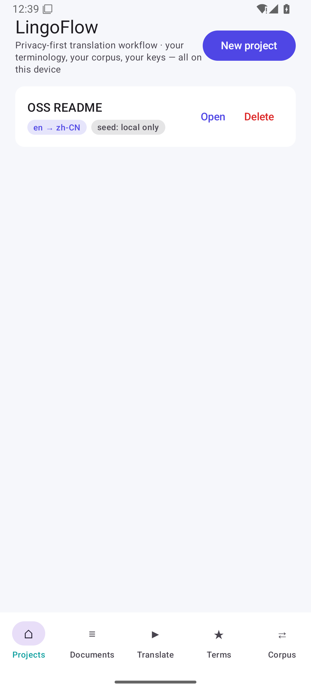
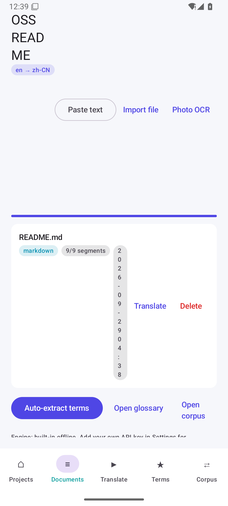
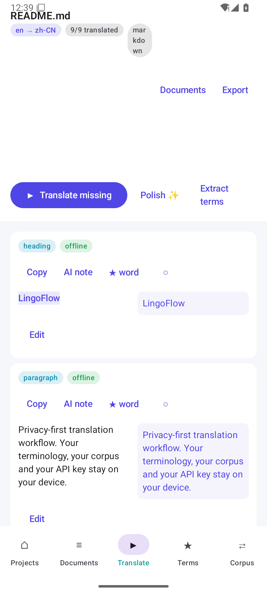
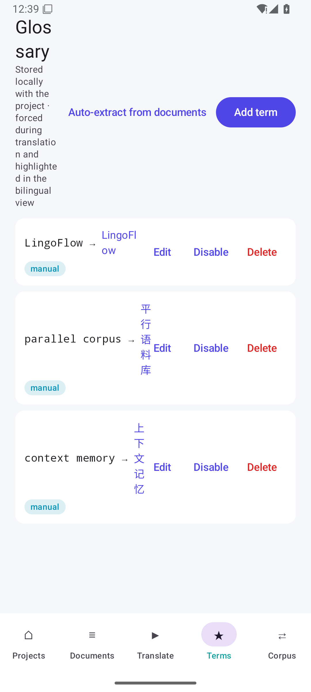

<div align="center">

# LingoFlow

**Privacy-first cross-platform translation workflow — build your own terminology corpus.**
**隐私优先的跨平台翻译工作流，搭建属于你的专属术语库。**

[](https://github.com/Lives0808/LingoFlow/releases)
[](LICENSE)
[](https://kotlinlang.org/docs/multiplatform.html)
[](https://www.jetbrains.com/lp/compose-multiplatform/)
[](#安装)
[](https://github.com/Lives0808/LingoFlow/actions/workflows/kmp.yml)

</div>

---

## 两个产品，一套理念

| | **LingoFlow App** | **LingoFlow CLI** |
| --- | --- | --- |
| 面向 | **文档翻译**：Markdown / DOCX / PDF / 字幕 / 图片 | **代码 i18n**：源码里的 `t('key')` 与语言文件 |
| 形态 | Kotlin Multiplatform：Android + macOS + Windows + Linux，一套 Compose UI | Node.js 命令行 + 8 种语言文件格式 |
| 共同点 | **本地存储 · 自带 API Key · 项目化管理 · 术语与语料沉淀 · 防返工** | 同左 |

> ✅ **本地存储**（纯 JSON 文件，可 git、可拷贝）✅ **自有 API Key**（无公共密钥、无中转服务、无遥测）
> ✅ **项目化管理**（每个项目独立术语/语料/词汇/文档）✅ **术语记忆**（强制匹配 + 人工修正自动入库）

---

## LingoFlow App：翻译工作流

| 项目管理 | 文档导入 |
| --- | --- |
|  |  |

| 双语对照（原文/译文并排，术语高亮） | 本地术语库 |
| --- | --- |
|  |  |

> 截图取自 Android 模拟器上真实运行的签名构建；同一套 Compose UI 也运行在 macOS / Windows / Linux 桌面端。

### 核心能力

- **项目化管理**：新建「雅思阅读」「开源项目 README」等项目，各自保存术语、上下文记忆、平行语料与词汇本
- **上下文记忆**：同一份文档翻译时，模型会收到前几段的原文与译文 + 术语表 + 你自己的历史译法，专业名词前后一致
- **双语对照视图**：原文与译文并排，逐段编辑；桌面端悬浮、手机端点击查看 AI 释义；手动改过的段落自动「冻结」，后续自动翻译不再覆盖
- **本地术语库**：手动添加 + **自动提取**（大小写短语/缩写/CJK 滑窗 + 频次打分），翻译时**强制匹配**，双语视图内高亮
- **平行语料库**：每一次人工修正都自动入库，之后遇到相似句子优先复用**你自己的译法**（阈值可调）
- **多模型 + 自有 Key**：内置离线引擎（零配置）/ OpenAI 兼容 / DeepSeek / 自定义端点 / 本地 Ollama；`Block every network engine` 在代码层强制
- **文档导入导出**：Markdown / TXT / SRT / DOCX / PDF（尽力提取）→ 双语 Markdown、纯译文、CSV、JSON、SRT、可打印 HTML（→PDF）
- **图片 OCR**（Android）：拍照或相册 → 裁剪/擦除 → 端上 ML Kit 识别（中日韩+拉丁）→ 直接翻译
- **语言润色**：英文改写、学术书面化、精简
- **双语词汇本**：一键收藏生词（含例句），导出 CSV / Anki TSV
- **体验**：深色/浅色主题、进度提示与友好报错、桌面快捷键（⌘1..5 切页、⌘T 翻译、⌘O 导入、⌘E 提取术语、⌘K 术语库）

### 安装

```bash
# Android（8.0+，约 33 MB）
adb install lingoflow-android-0.3.0.apk

# macOS / Windows / Linux
# LingoFlow-0.3.0.dmg · LingoFlow-0.3.0.msi · lingoflow_0.3.0_amd64.deb
```

### 开发

```bash
cd app
./gradlew :jvmCore:test :shared:desktopTest   # 领域层测试（文档解析/术语/语料/翻译编排）
./gradlew :desktopApp:run                     # 桌面端
./gradlew :androidApp:assembleDebug           # Android
./gradlew :desktopApp:packageDmg              # 对应平台的安装包
```

---

## ⚠️ Limitations（坦诚版）

- **PDF 提取是尽力而为**：自写解析器（FlateDecode + ToUnicode CMap），多栏/表格/旋转文字会串行或丢行；**扫描件 PDF 无文本层，必须走 OCR**。
- **DOCX 只取正文段落**：忽略表格、文本框、图片、批注与页眉页脚；复杂排版建议先转 Markdown。
- **桌面 OCR 依赖外部 Tesseract**（不静默下载模型）；Android 为端上 ML Kit，开箱即用。
- **PDF 导出 = 打印到 PDF**：生成自包含 HTML 后用浏览器打印；不内嵌 CJK 字体。
- **离线引擎质量有限**：术语表 + 语料 + 种子词典的组合，长句翻译一般；需要模型质量请填自己的 Key。
- **上下文记忆有窗口**（默认前 6 段），跨章节一致性主要靠术语表与语料库；超长文档建议分章处理。
- **无自动更新 / 无云端同步 / 无 iOS 目标**（shared 已为 iOS 预留结构）。
- **UI 无自动化测试**：领域层有测试（13 项），界面靠真机/模拟器验证 + CI 构建校验。
- **P2 未实现**：实时剪贴板监听、字幕时间轴联动编辑。

架构、技术选型、核心代码示例与更完整的边界说明见 [`app/docs/architecture.md`](app/docs/architecture.md)。

---

## LingoFlow CLI：代码 i18n

```bash
lingoflow init --preset react && lingoflow sync     # 扫描 → 抽取 → 翻译 → 校验 → 回写 → 学习
lingoflow check --fail-on warn                      # CI 门禁（占位符/ICU/CJK 排版/长度/术语一致性）
```

- 8 种语言文件格式无损读写（JSON/JSON5、YAML、`.properties`、gettext `.po`、Flutter `.arb`、Apple `.strings`、CSV、TS/JS）
- UI 长度预检（字体度量 px/字符 + 14 类控件预算）、伪本地化压测、SARIF 报告
- 私有记忆库（SQLite/JSONL）+ 术语表 + 从审校差异学习的修正规则

详见 [CLI 工作流](docs/workflow.md) 与 [配置参考](docs/configuration.md)。

---

## 仓库结构

```
app/                       Kotlin Multiplatform 应用
  shared/                  commonMain：文档模型/术语/语料/翻译编排/Compose UI（无平台依赖）
  jvmCore/                 文件工作区 · DOCX/PDF 解析 · OkHttp 模型引擎 · 桌面服务
  androidApp/              SAF 选择器 · ML Kit OCR · Keystore 密钥 · 裁剪擦除
  desktopApp/              macOS/Windows/Linux 入口 · 文件对话框 · 快捷键
  docs/architecture.md     功能架构 · 技术选型 · 核心代码示例 · 缺陷边界
src/                       Node CLI（代码 i18n）
```

## License

MIT © [Lives0808](https://github.com/Lives0808)
