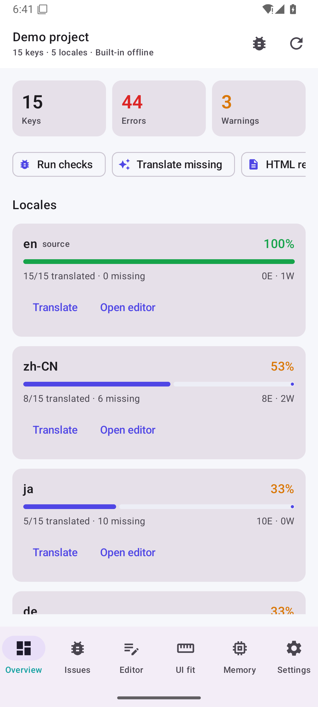
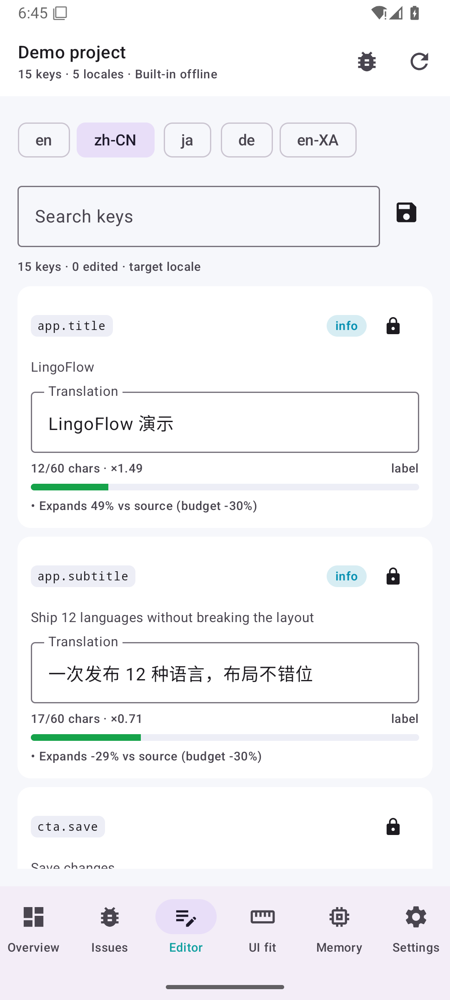
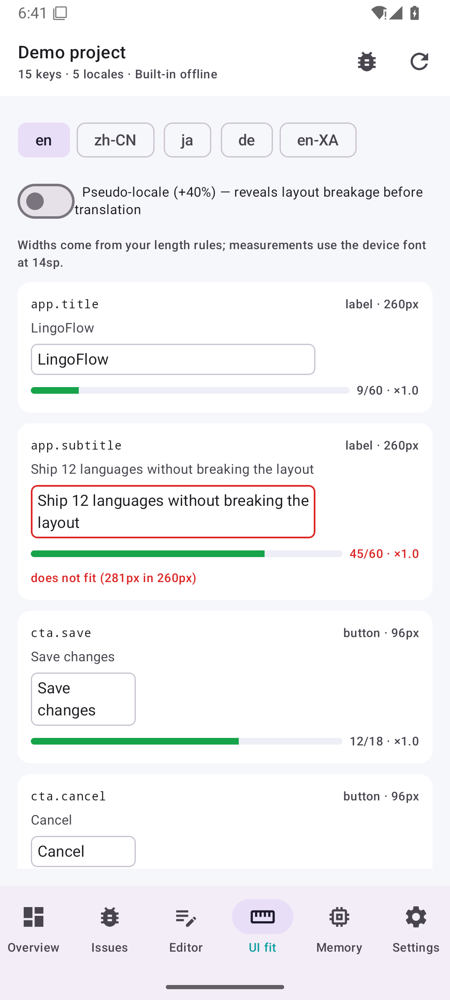
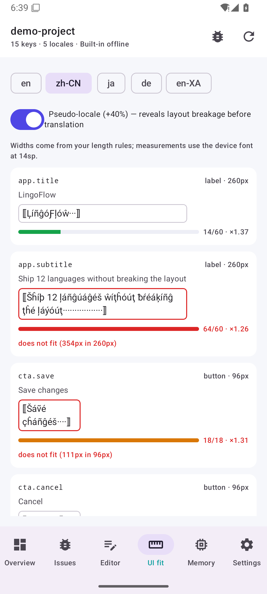

# LingoFlow for Android

The native Android companion to the LingoFlow i18n pipeline — Kotlin + Jetpack Compose,
no WebView, no Node runtime on the device.

> **Why a phone app?** Reviewing translations is a mobile-friendly job: translators, PMs and
> designers can validate wording, placeholders and UI fit while away from the desk, and the
> app learns from those reviews on-device.

## Screenshots

| Overview | Editor (live validation) |
| --- | --- |
|  |  |

| UI fit (real font metrics) | Pseudo-locale stress test |
| --- | --- |
|  |  |

*(Captured on an API 35 emulator from the signed release APK.)*

## Features

| Area | What it does |
| --- | --- |
| **Project access** | Opens any repository folder through the system picker (SAF) or the built-in demo project. Reads `lingoflow.config.json` and the same catalogs as the CLI. |
| **Catalog formats** | JSON/JSON5/JSONC (comments preserved), YAML subset, `.properties`, gettext `.po` (context + plurals), Flutter `.arb`, Apple `.strings`, CSV (multi-locale), TS/JS modules. |
| **Validation** | Placeholders (`{name}`, `{{count}}`, `%s`, `%1$s`, `${x}`, `$t(key)`), ICU structure and CLDR plural categories, HTML tag balance/attributes, whitespace, punctuation, CJK typography, script mismatch, glossary/do-not-translate, same-source-same-target consistency, forbidden terms. |
| **Length & UI fit** | Real font metrics via `Paint.measureText` — not an approximation. 14 widget presets, glob-matched budgets, per-locale expansion budgets, pixel-accurate overflow detection, and a pseudo-locale toggle (+40%) to stress layouts *before* translating. |
| **Translation** | Built-in offline engine (glossary + translation memory + seed dictionary), pseudo-locale, any OpenAI-compatible endpoint (including a local Ollama/LM Studio server), LibreTranslate, or a custom HTTP template. Plan preview before anything is written. |
| **Anti-rework** | Approve **and freeze** a translation — later runs (even forced ones) will not overwrite it and report the difference instead. |
| **Learning** | `Learn from edits` mines reviewer changes into correction rules, approved copy into style rules, and repeated term pairs into glossary candidates. |
| **Reports** | HTML / Markdown / JSON reports written next to the project or shared through the system share sheet. |
| **Privacy** | The built-in engine never touches the network. `Block every network engine` is enforced in code. API keys are encrypted with an Android Keystore key. No accounts, no telemetry. |

## Build

Requirements: JDK 17+ and an Android SDK with platform 36 + build-tools 36.

```bash
export JAVA_HOME=/path/to/jdk
export ANDROID_HOME=$HOME/Library/Android/sdk
cd android
echo "sdk.dir=$ANDROID_HOME" > local.properties     # or set ANDROID_HOME

./gradlew :app:assembleDebug        # debug APK
./gradlew :app:testDebugUnitTest    # 30+ JVM unit tests for the core
./gradlew :app:assembleRelease      # signed release APK (see keystore below)
```

The APK lands in `app/build/outputs/apk/{debug,release}/`.

## Signing

`keystore/lingoflow.jks` is committed **on purpose**: it is an open-source release key whose
only purpose is update continuity (`storepass`/`keypass` are `lingoflow`). Override it in CI or
for your own builds:

```bash
export LINGOFLOW_KEYSTORE_PASSWORD=…
export LINGOFLOW_KEY_ALIAS=…
export LINGOFLOW_KEY_PASSWORD=…
```

Never reuse this key for anything private — anyone can read it from the repository.

## Architecture

```
app/src/main/java/dev/lingoflow/app/
  core/                 pure Kotlin, fully unit tested on the JVM
    catalog/            Jsonish parser, Keys, 8 catalog formats
    config/             lingoflow.config.json → data classes
    model/              entries, issues, rules, memory rows, widget presets, TextMeasurer
    rules/              glossary/DNT protection, corrections, styles, Learn
    tm/                 MemoryStore contract, fuzzy matching, in-memory store
    translate/          engine contract, offline engine, seed dictionary, pseudo-locale
    validate/           placeholders, ICU, tags, text/CJK, length, Validator, Fixer
    project/            ProjectSource, loader/saver, Pipeline (plan→translate→fix→validate→learn)
    report/             HTML / Markdown / JSON
  data/                 Android specifics: SAF + file sources, SQLite memory, prefs, Keystore, OkHttp engines, Paint metrics
  ui/                   Compose theme, shell, screens (overview, issues, editor, UI fit, memory, settings)
  vm/                   MainViewModel: single state holder
```

The `core` package has no Android dependencies, so `./gradlew test` runs the entire validation
and pipeline logic on the JVM — the same behaviour the CLI has, verified on every CI run.

## Compatibility with the CLI

Both tools share the configuration file, catalog formats and validation codes, so a project can
be reviewed on a phone and gated in CI on a desktop:

```bash
lingoflow check --fail-on warn              # CI gate (CLI)
lingoflow-android                            # the same checks, on the go
```

The app keeps its own translation memory and rules in private storage; use
`Memory → Learn from edits` on the phone, or `lingoflow rules export` on the desktop to share
rules through git.
